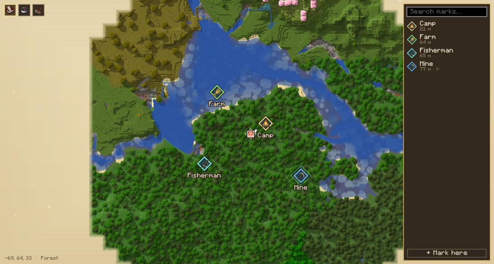
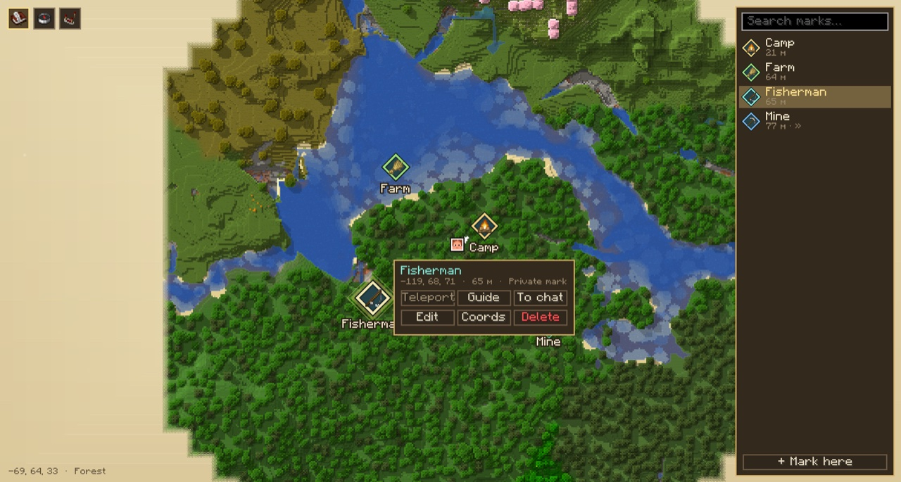
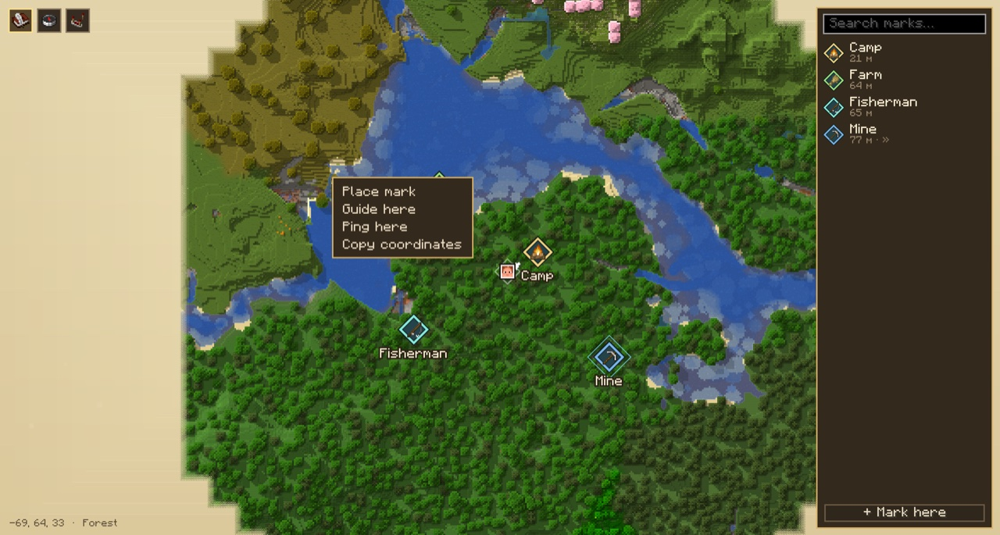
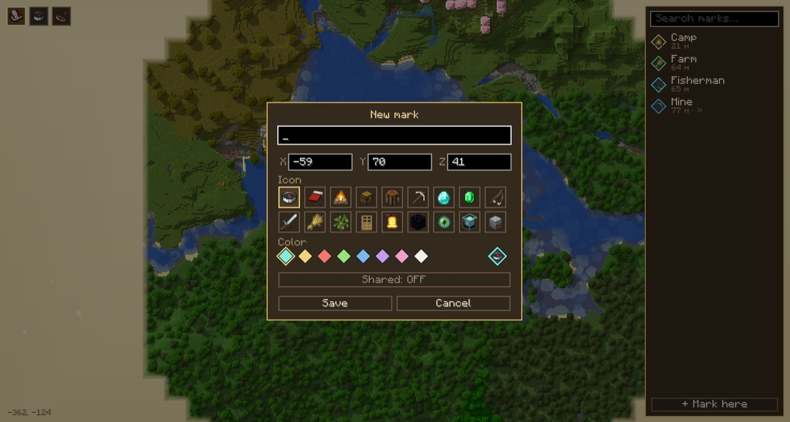
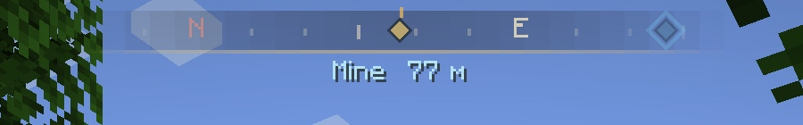
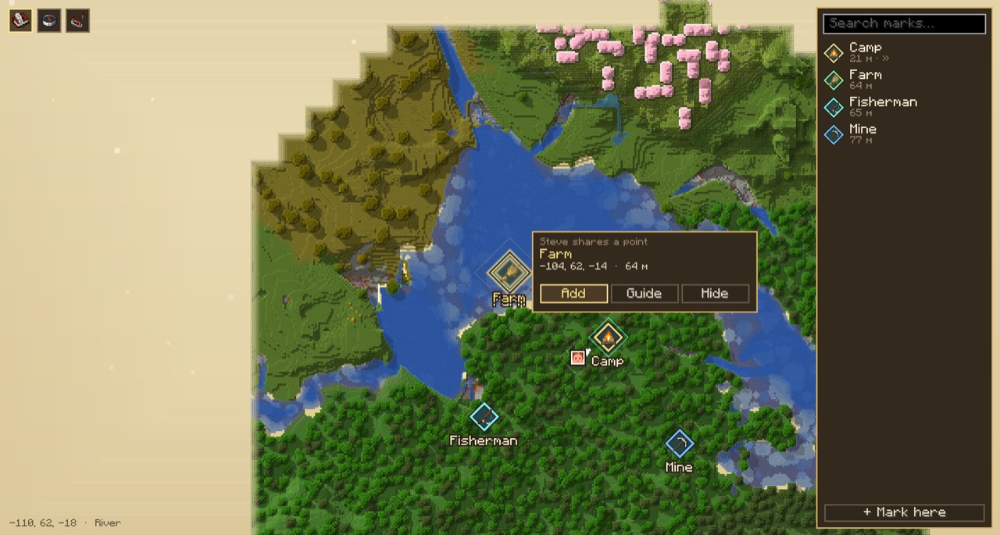

# World Map

> **Experimental.** This is a personal experiment, not a polished release. Expect bugs, rough edges and breaking changes between versions. Back up your worlds.

A parchment-style world map for Minecraft: textured terrain rendering, marks, navigation, and shared marks and teleport on servers.

The mod works in singleplayer and on vanilla servers. When the mod is also installed on the server, you get shared marks, player positions, pings and teleport from the map.



## Features

**Textured map.** Terrain is drawn with block textures and fills in as you explore. The sidebar lists your marks with distances and a search box.

**Marks.** Click a mark to open its card: teleport, guide to it, send it to chat, edit, copy coordinates or delete.



**Context menu.** Right-click anywhere on the map to place a mark, set a guide point, ping or copy coordinates.



**Mark editor.** Name, coordinates, icon from a set of items, colour, and a shared flag.



**Compass and navigation.** A compass bar at the top of the screen shows directions, marks and the distance to the current guide point.



**Sharing points.** Send a mark to chat. Other players with the mod get a "Show on map" button and can add the point to their map.



Deaths are marked on the map automatically. This can be turned off in the settings.

## Supported versions

| Minecraft      | Fabric | NeoForge | Forge |
|----------------|:------:|:--------:|:-----:|
| 1.20–1.20.1    | ✓      |          | ✓     |
| 1.20.3–1.20.4  | ✓      | ✓        |       |
| 1.20.5–1.20.6  | ✓      | ✓        |       |
| 1.21–1.21.1    | ✓      | ✓        |       |
| 1.21.2–1.21.3  | ✓      | ✓        |       |
| 1.21.4         | ✓      | ✓        |       |
| 1.21.5         | ✓      | ✓        |       |
| 1.21.6–1.21.8  | ✓      | ✓        |       |
| 1.21.9–1.21.10 | ✓      | ✓        |       |
| 1.21.11        | ✓      | ✓        |       |
| 26.1           | ✓      | ✓        |       |
| 26.2           | ✓      | ✓        |       |
| 26.3           | ✓      | ✓        |       |

Fabric requires [Fabric API](https://modrinth.com/mod/fabric-api).

## Controls

- `M`: open the map
- `N`: toggle the compass
- `B`: new mark at your position

## Server

Settings live in `config/worldmap-server.json`. Shared marks are stored in the world (`worldmap_marks.json`). `/worldmap reload` reloads the settings (operator only).

| Option                    | Default | Description                                         |
|---------------------------|---------|-----------------------------------------------------|
| `teleport`                | `op`    | who can teleport: `all`, `op`, `none`               |
| `teleportCooldownSeconds` | `10`    | teleport cooldown (operators are exempt)            |
| `publicMarks`             | `all`   | who can create shared marks: `all`, `op`            |
| `sharePlayerPositions`    | `true`  | show players on the map                             |
| `pings`                   | `true`  | allow pings                                         |
| `maxPublicMarks`          | `500`   | shared marks limit                                  |

## Building

One source tree is built for every version and loader with [Stonecutter](https://stonecutter.kikugie.dev/). Gradle runs on JDK 25. Gradle downloads JDK 17/21 for older versions itself.

```sh
./gradlew buildAll                              # all variants → build/libs/<mod version>/
./gradlew :1.21.1-fabric:build                  # a single variant
./gradlew :1.21.1-fabric:runClient -Pdemo=sp    # demo scenario that takes the screenshots above
```

The active version in the sources is `1.20.1-fabric`. Switch it with the `Set active project to <version>` task from the `stonecutter` group, and reset it before committing.

## License

[MIT](LICENSE)
